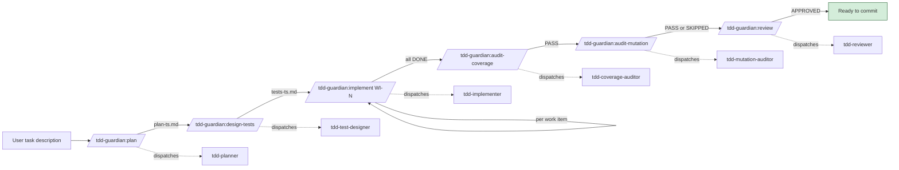

# TDD Guardian — Guide

TDD Guardian enforces strict test-driven development through six specialized agents, five shared partials, seven focused commands, a workflow orchestrator, and two gating hooks. This guide walks through a real-world session, explains the architecture, and answers common questions.

## The pipeline at a glance



Any failed gate halts the pipeline; the user fixes the evidence surfaced by the report and re-runs only the failed stage.

## Walkthrough — Building a JWT token validator with TDD Guardian

### 1. Initialize (once per project)

```
/tdd-guardian:tdd-guardian-init
```

The init command globs for a manifest (`package.json` in this example), detects Vitest, and proposes:

- `testCommand=pnpm test`
- `coverageCommand=pnpm test -- --coverage`
- `coverageSummaryPath=coverage/coverage-summary.json`
- 100% thresholds for lines/functions/branches/statements
- `requireMutation=false` (can enable later)

It writes `.claude/tdd-guardian/config.json` and appends `.claude/tdd-guardian/state.json` to `.gitignore`.

### 2. Plan

```
/tdd-guardian:plan validate JWT tokens against a JWKS endpoint, rejecting expired or tampered tokens with a typed error
```

`tdd-planner` returns something like:

```
# TDD Plan: JWT validator

## Work Items

### WI-1: JWKS key fetcher with in-memory cache
- Acceptance criteria:
  - [ ] Fetches keys from configured JWKS URL
  - [ ] Caches keys with TTL from Cache-Control max-age
  - [ ] Refetches when cache expires
- Required tests:
  - Fetch success → returns array of JWKs — Level 1 (output verification)
  - Cached fetch → second call returns without network — Level 2 (side effect: fetch count)
  - Expired cache → refetches — Level 2

### WI-2: Token signature verification
...

### WI-3: Expiration + nbf validation
...

## Risks & Assumptions
- JWKS endpoint availability: assume 5xx should be surfaced, not masked
- Clock skew: assume ±5 seconds tolerance

## Deferred / Out of Scope
- Key rotation webhook support
```

Plan lives at `.claude/tdd-guardian/plan-20260424-094500.md`.

### 3. Design tests

```
/tdd-guardian:design-tests .claude/tdd-guardian/plan-20260424-094500.md
```

`tdd-test-designer` produces a matrix per work item, with every case specifying assertion strategy (Level 1-5) and mock boundary. The command's wiring-only quality gate re-dispatches up to twice if any case slips through with only Level 6-7 assertions.

Matrix lives at `.claude/tdd-guardian/tests-20260424-094800.md`.

### 4. Implement work items

```
/tdd-guardian:implement WI-1
```

`tdd-implementer`:
1. Writes `test/jwks-fetcher.test.ts` first — runs, fails (red).
2. Writes minimal `src/jwks-fetcher.ts` — runs `pnpm test`, passes (green).
3. Reports `Status: DONE` with test and source file paths, verification output, and duration.

Then repeat:

```
/tdd-guardian:implement WI-2
/tdd-guardian:implement WI-3
```

If any verification fails, the command lets the user retry once; a second failure stops the workflow.

### 5. Coverage gate

```
/tdd-guardian:audit-coverage
```

Runs `pnpm test -- --coverage`, normalizes the Istanbul JSON summary, compares against thresholds. On PASS, writes `.claude/tdd-guardian/coverage-20260424-101200.md` and updates `state.json`. On FAIL, lists uncovered branches per file and proposes Level 1-5 tests to close each gap.

### 6. Mutation gate (if enabled)

```
/tdd-guardian:audit-mutation
```

With `requireMutation=false`, skipped silently. To enable, edit config and add `mutationCommand=npx stryker run`, install Stryker with a runner plugin, and re-run.

Stryker mutates `<`, `<=`, string literals, etc. Survivors are reported with file:line, mutator type, and a boundary-test fix. The `mutation-gate` skill catalogs common patterns (off-by-one, short-circuit asymmetry, string-literal leaks).

### 7. Review

```
/tdd-guardian:review
```

`tdd-reviewer` reads every changed source and test file, classifies each `expect()` call:
- Level 1-5 (behavior) — PASS
- Level 6-7 (wiring) — FAIL if sole assertion in an `it()` block

Flags mocked internal modules, security checks via mock args, missing error-path coverage. Produces severity-sorted findings and a verdict of APPROVED / APPROVED WITH NOTES / CHANGES REQUESTED / BLOCKED.

### 8. Status check

Anytime:

```
/tdd-guardian:status
```

Reads `state.json` + globs recent artifacts. Zero agents dispatched, zero commands run. Shows last coverage/mutation/review results, per-work-item state, artifact counts, and a next-step hint.

### 9. The orchestrator version

All of the above can be chained with one command:

```
/tdd-guardian-workflow validate JWT tokens against a JWKS endpoint...
```

It invokes the seven focused commands in order, halts at the first gate failure, and persists every artifact to `.claude/tdd-guardian/`.

## Architecture

### Commands

| Kind | Count | Role |
|------|-------|------|
| Entry commands | 2 | `tdd-guardian-init`, `tdd-guardian-workflow` |
| Focused commands | 7 | `plan`, `design-tests`, `implement`, `audit-coverage`, `audit-mutation`, `review`, `status` |
| Shared partials | 5 | `load-config`, `detect-stack`, `run-tests`, `parse-coverage`, `parse-mutation` |

Every focused command dispatches exactly ONE agent (or, for `status`, zero agents). The workflow command chains the focused commands; it does not re-implement their logic.

### Agents

| Agent | Role | Tools |
|-------|------|-------|
| tdd-planner | Decompose tasks into work items | read-only |
| tdd-test-designer | Build behavior-driven test matrices | read + limited write (matrix file only) |
| tdd-implementer | Red-green-refactor one WI at a time | read + write + test runner |
| tdd-coverage-auditor | Run coverage, compare, propose tests | read + test runner |
| tdd-mutation-auditor | Run mutation, list survivors, strengthen tests | read + write test files + mutation runner |
| tdd-reviewer | Classify assertions, flag anti-patterns | read-only |

### Skills

| Skill | Role |
|-------|------|
| policy-core | Assertion hierarchy (Level 1-7), mock rules, completion gates |
| test-matrix | Matrix categories, assertion strategy table, mock decision tree |
| coverage-gate | Coverage thresholds, test-quality scan, v8 ignore directive audit |
| mutation-gate | Per-language tool reference, operator catalog, surviving-mutant patterns |
| review-gate | Final-review rubric |
| init | Initialization checks |
| workflow | Workflow orchestration reference |

### Hooks

| Hook | Script | Role |
|------|--------|------|
| PreToolUse (Bash matcher) | `pretool_guard.js` | Blocks `git commit/push` when gates are stale |
| TaskCompleted | `taskcompleted_gate.js` | Optional — runs gate checks on task completion |

## FAQ

### Q: What if I don't have mutation tooling installed?

A: Leave `requireMutation=false` in config (the default). The mutation stage is skipped silently. When you want to enable, install the tool for your stack (`pnpm add -D @stryker-mutator/core ...`, `pip install mutmut`, `go install ...`, `cargo install cargo-mutants`), set `mutationCommand` and `requireMutation=true` in `.claude/tdd-guardian/config.json`.

### Q: How do I skip a gate temporarily?

A: Set the env var named in `bypassEnv` (default `TDD_GUARD_BYPASS`) to a truthy value for the session: `export TDD_GUARD_BYPASS=1`. The hooks will not block commits. Do this only with explicit team consent — the bypass is for emergencies, not for habitual use. Prefer fixing the failing gate.

### Q: Can I use this for a non-Node project?

A: Yes. The `detect-stack` partial supports Node, Python, Go, and Rust. `tdd-guardian-init` detects your stack and proposes the right commands. All commands and agents are language-agnostic; only the stack-specific defaults differ.

### Q: What counts as a "wiring-only" test?

A: An `it()` / `test()` block whose every `expect()` call is Level 6-7 (mock call args or mock-was-called) with no Level 1-5 (output, side effect, integration, state) assertion. Example: `expect(mockCreate).toHaveBeenCalledWith(opts)` alone is wiring-only. Adding `expect(result.id).toMatch(/^mx-/)` to the same test makes it a behavior test.

### Q: The planner produced 12 work items for a small feature. Too many?

A: Re-run `/tdd-guardian:plan` with a tighter scope description, or use AskUserQuestion to tell the planner to prefer coarser-grained items. The planner's granularity target is "one work item = one red-green-refactor cycle of 15-60 minutes." Smaller is fine; larger is risky because verification feedback gets slower.

### Q: Can I run multiple work items in parallel?

A: No. The implementer spec explicitly forbids advancing to the next work item before the current one passes verification. Parallelism would hide interleaved failures. Run them sequentially; if that's too slow, the plan's work items are probably too large.

### Q: What if my coverage tool doesn't measure functions (e.g., LCOV only)?

A: The `parse-coverage` partial returns `null` for unmeasured dimensions. When a threshold is `> 0` and the metric is null, the gate produces a WARN not a FAIL, with a clear message telling you to either configure your tool to emit functions, or lower the threshold to 0.

### Q: How do I audit a single file's coverage?

A: Pass the path as the argument: `/tdd-guardian:audit-coverage src/queue.ts`. The gate still evaluates whole-project totals — you can't lower the bar for one file — but the uncovered-code and proposed-tests tables focus on that path.

## Troubleshooting

### Hooks not firing

Symptoms: `git commit` goes through even when coverage fails.

Checks:
1. Verify `hooks/hooks.json` exists in the installed plugin: `ls ~/.claude/plugins/cache/xiaolai/tdd-guardian/*/hooks/hooks.json`.
2. Verify `blockCommitWithoutFreshGate=true` in `.claude/tdd-guardian/config.json` (or whatever flag you're relying on).
3. Restart Claude Code after any install / update.
4. Check `~/.claude/logs/hooks.log` for the PreToolUse invocation.

### Config missing

Symptoms: every command stops with "TDD Guardian config not found".

Fix: run `/tdd-guardian:tdd-guardian-init`. Do NOT write the config by hand unless you know exactly which fields are required — `load-config.md` enforces all required fields and will reject partial configs.

### Plan missing when design-tests runs

Symptoms: `/tdd-guardian:design-tests` stops with "No plan found".

Fix: run `/tdd-guardian:plan <task>` first. The plan command writes `.claude/tdd-guardian/plan-{timestamp}.md` which the design-tests command globs for.

### Coverage shows 100% but mutation score is low

This is the exact problem TDD Guardian is designed to catch. Coverage only measures which lines ran; mutation measures whether the tests would catch a changed line. Low mutation score with high coverage almost always means wiring-only tests. Run `/tdd-guardian:review` — it will flag them.

### Runner says "no tests found"

The `run-tests` partial classifies this as status `no-tests`, separate from `fail`. The implementer did not write tests as instructed. Re-dispatch with a tighter prompt, or inspect the test file paths and runner config — your runner may not be discovering them.

### Mutation tool takes hours

Stryker, cargo-mutants, and go-mutesting can run for a long time on large codebases. Mitigations:
- Stryker: `"coverageAnalysis": "perTest"` — only reruns tests that touch the mutated line.
- cargo-mutants: `cargo mutants --shard 1/4` across CI workers.
- go-mutesting: narrow the scope to changed files.
- Use `--exec-timeout` to cap slow mutant runs.

Do not disable the mutation gate as the default response to slowness; optimize first.

## Related skills

- `tdd-guardian:policy-core` — the assertion hierarchy and mock rules every agent enforces.
- `tdd-guardian:test-matrix` — the matrix format the designer produces.
- `tdd-guardian:coverage-gate` — the coverage thresholds and test-quality scan rubric.
- `tdd-guardian:mutation-gate` — the mutation tool reference, operator catalog, and survivor patterns.
- `tdd-guardian:review-gate` — the final review rubric and severity calibration.
