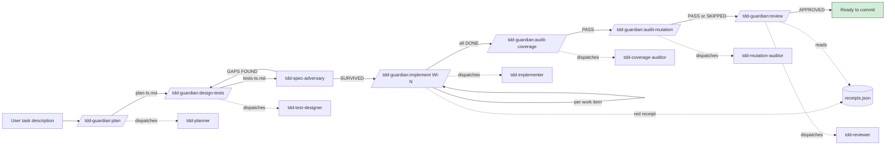

# TDD Guardian — Guide

TDD Guardian enforces strict test-driven development through seven specialized agents, five shared partials, nine focused commands, a workflow orchestrator, two gating hooks, and a red-receipt CLI. This guide walks through a real-world session, explains the architecture, and answers common questions.

## The pipeline at a glance


```mermaid
flowchart LR
    User[User task description] --> Plan[/tdd-guardian:plan/]
    Plan -->|plan-ts.md| Design[/tdd-guardian:design-tests/]
    Design -->|tests-ts.md| Attack[tdd-spec-adversary]
    Attack -->|SURVIVED| Impl[/tdd-guardian:implement WI-N/]
    Attack -->|GAPS FOUND| Design
    Impl -->|per work item| Impl
    Impl -->|all DONE| Cov[/tdd-guardian:audit-coverage/]
    Cov -->|PASS| Mut[/tdd-guardian:audit-mutation/]
    Mut -->|PASS or SKIPPED| Rev[/tdd-guardian:review/]
    Rev -->|APPROVED| Done[Ready to commit]

    Plan -. dispatches .-> PlannerAgent[tdd-planner]
    Design -. dispatches .-> DesignerAgent[tdd-test-designer]
    Impl -. dispatches .-> ImplAgent[tdd-implementer]
    Impl -. red receipt .-> Receipt[(receipts.json)]
    Rev -. reads .-> Receipt
    Cov -. dispatches .-> CovAgent[tdd-coverage-auditor]
    Mut -. dispatches .-> MutAgent[tdd-mutation-auditor]
    Rev -. dispatches .-> RevAgent[tdd-reviewer]

    style Done fill:#d4edda,stroke:#155724
```

Any failed gate halts the pipeline; the user fixes the evidence surfaced by the report and re-runs only the failed stage.

Note where the adversary sits. It is the only gate that runs **before** an implementation exists — every other one reads code that has already been written, by which point the specification has been shaped by knowing how the thing was built. That loop back to `design-tests` is the one place the specification can still be strengthened independently.

## Walkthrough — Building a JWT token validator with TDD Guardian

### 1. Initialize (once per project)

```
/tdd-guardian:init
```

Init reads `.github/workflows/ci.yml` first — it has `test` and `e2e` jobs, so this repo has two lanes. It confirms Vitest from `package.json` and Playwright from `playwright.config.ts`, then probes each: `vitest list` finds 148 tests, `playwright test --list` finds 31.

It proposes:

| Lane | Command | Trigger | Coverage |
|------|---------|---------|----------|
| `unit` | `pnpm exec vitest run --coverage` | `taskCompleted`, `commit` | include → `coverage/coverage-summary.json` |
| `e2e` | `pnpm exec playwright test --project=chromium` | `push` | none — no instrumented build exists |

plus 100% thresholds, `requireMutation=false`, and both blocking switches off.

After you confirm, it writes `.claude/tdd-guardian/config.json` and appends `.claude/tdd-guardian/state.json` to `.gitignore`. Config is committed (shared team configuration); state is per-machine gate history and is not.

Re-verify at any time with `/tdd-guardian:probe` — it re-runs the dry-run listings without executing a suite.

### 2. Plan

```
/tdd-guardian:plan validate JWT tokens against a JWKS endpoint, rejecting expired or tampered tokens with a typed error
```

`tdd-planner` returns something like:

```
# TDD Plan: JWT validator

## Work Items

### WI-1: JWKS key fetcher with in-memory cache
- Acceptance criteria:
  - [ ] Fetches keys from configured JWKS URL
  - [ ] Caches keys with TTL from Cache-Control max-age
  - [ ] Refetches when cache expires
- Required tests:
  - Fetch success → returns array of JWKs — Level 1 (output verification)
  - Cached fetch → second call returns without network — Level 2 (side effect: fetch count)
  - Expired cache → refetches — Level 2

### WI-2: Token signature verification
...

### WI-3: Expiration + nbf validation
...

## Risks & Assumptions
- JWKS endpoint availability: assume 5xx should be surfaced, not masked
- Clock skew: assume ±5 seconds tolerance

## Deferred / Out of Scope
- Key rotation webhook support
```

Plan lives at `.claude/tdd-guardian/plan-20260424-094500.md`.

### 3. Design tests

```
/tdd-guardian:design-tests .claude/tdd-guardian/plan-20260424-094500.md
```

`tdd-test-designer` produces a matrix per work item. Every unit answers the law question once — *does this have a conserved quantity, a round-trip, an idempotent operation?* — and every case specifies a lane, an assertion strategy (Level 1-5), a specification level (S1-S6), a mock boundary, and, whenever a boundary is mocked, the paired integration-lane case covering the real path.

Then `tdd-spec-adversary` attacks the finished matrix:

```
## Verdict: GAPS FOUND (1)

### Gap 1: half the operation
- Passing-but-wrong implementation:
    verify(token) { return decodeHeader(token).alg !== "none" }
- Why every listed case passes: all three examples use tokens whose
  signature happens to be valid, so no case distinguishes "checked the
  signature" from "checked the algorithm field".
- Missing case: a token with a valid header and a tampered payload
  - Level: S3 — a named failure mode
  - Assertion: expect(() => verify(tampered)).toThrow(InvalidSignature)
```

The designer is re-dispatched with the gap report, up to twice. The command's wiring-only quality gate also re-dispatches if any case slips through with only Level 6-7 assertions.

Matrix lives at `.claude/tdd-guardian/tests-20260424-094800.md`.

### 4. Implement work items

```
/tdd-guardian:implement WI-1
```

`tdd-implementer`:
1. Writes `test/jwks-fetcher.test.ts` first — runs, fails (red).
2. Records the red: `receipt.js record --id WI-1`. This confirms the failure was a real assertion failure (`3 of 3 tests failed`) rather than a missing module or a zero-test run, and fingerprints the test file.
3. Writes minimal `src/jwks-fetcher.ts` — runs `pnpm test`, passes (green).
4. Verifies the specification held: `receipt.js verify --id WI-1`. If an assertion in `jwks-fetcher.test.ts` changed between steps 2 and 4, that is reported as a High finding — the implementation edited its own acceptance criteria.
5. Reports `Status: DONE` with test and source file paths, the separation verdict, verification output, and duration.

Then repeat:

```
/tdd-guardian:implement WI-2
/tdd-guardian:implement WI-3
```

If any verification fails, the command lets the user retry once; a second failure stops the workflow.

### 5. Coverage gate

```
/tdd-guardian:audit-coverage
```

Runs every lane with `coverage: "include"`, merges their reports (union when all carry per-line detail, weighted and flagged otherwise), and compares the merged totals against thresholds — then evaluates each `criticalPaths` entry against its own stricter bar. On PASS, writes `.claude/tdd-guardian/coverage-20260424-101200.md` and updates `state.json`. On FAIL, lists uncovered branches per file with the lane each gap belongs in, and proposes tests to close each with both an assertion level and a specification level.

A critical path can fail while the project total passes; that is the point of having it. A glob matching no file is reported as `matched nothing` rather than as a pass — a threshold enforcing nothing must never look enforced.

### 6. Mutation gate (if enabled)

```
/tdd-guardian:audit-mutation
```

With `requireMutation=false`, skipped silently. To enable, edit config and add `mutationCommand=npx stryker run`, install Stryker with a runner plugin, and re-run.

Stryker mutates `<`, `<=`, string literals, etc. Survivors are reported with file:line, mutator type, and the boundary test that would kill each — the auditor proposes, the implementer writes. The `mutation-gate` skill catalogs common patterns (off-by-one, short-circuit asymmetry, string-literal leaks).

### 7. Review

```
/tdd-guardian:review
```

`tdd-reviewer` reads every changed source and test file, classifies each `expect()` call:
- Level 1-5 (behavior) — PASS
- Level 6-7 (wiring) — FAIL if sole assertion in an `it()` block

Flags mocked internal modules, security checks via mock args, missing error-path coverage. Produces severity-sorted findings and a verdict of APPROVED / APPROVED WITH NOTES / CHANGES REQUESTED / BLOCKED.

### 8. Status check

Anytime:

```
/tdd-guardian:status
```

Reads `state.json` + globs recent artifacts. Zero agents dispatched, zero commands run. Shows last coverage/mutation/review results, per-work-item state, artifact counts, and a next-step hint.

### 9. The orchestrator version

All of the above can be chained with one command:

```
/tdd-guardian:workflow validate JWT tokens against a JWKS endpoint...
```

It invokes the six focused commands in order, halts at the first gate failure, and persists every artifact to `.claude/tdd-guardian/`.

## Architecture

### Commands

| Kind | Count | Role |
|------|-------|------|
| Entry commands | 2 | `init`, `workflow` |
| Focused commands | 9 | `plan`, `design-tests`, `implement`, `audit-coverage`, `audit-mutation`, `review`, `status`, `probe`, `gate` |
| Shared partials | 5 | `load-config`, `detect-tooling`, `run-lane`, `parse-coverage`, `parse-mutation` |

Every focused command dispatches exactly ONE agent (or, for `status`, `probe`, and `gate`, zero agents). The workflow command chains the focused commands; it does not re-implement their logic.

### Libraries

The gate logic that both hooks and several commands depend on is implemented once, in plain CommonJS with no dependencies, and tested:

| Module | Role |
|--------|------|
| `lib/config.js` | Load, migrate schema v1→v2, validate lanes |
| `lib/coverage.js` | Parse 9 coverage formats; merge as union or weighted |
| `lib/lanes.js` | Lane selection by trigger, execution, state, freshness |
| `lib/exec.js` | Run a command and classify runner failure vs test failure |
| `lib/verification.js` | Classify a red, fingerprint spec files, verify separation held |

Commands should invoke these rather than re-deriving the logic in prose — hand-parsing LCOV or XML in a prompt is where wrong numbers come from.

One executable sits alongside the hooks: `scripts/tdd-guardian/receipt.js`, the red-receipt CLI. `/tdd-guardian:implement` runs `record` between red and green, then `verify` once the lane is green.

### Agents

| Agent | Role | Tools |
|-------|------|-------|
| tdd-planner | Decompose tasks into work items | read-only |
| tdd-test-designer | Build behavior-driven test matrices | read + limited write (matrix file only) |
| tdd-spec-adversary | Attack the matrix before code exists; find the wrong implementation that passes | read-only |
| tdd-implementer | Red-green-refactor one WI at a time, with red receipts | read + write + test runner |
| tdd-coverage-auditor | Run coverage, compare, propose tests | read + test runner |
| tdd-mutation-auditor | Run mutation, list survivors, propose killing tests | read + mutation runner |
| tdd-reviewer | Classify assertions, flag anti-patterns | read-only |

### Skills

| Skill | Role |
|-------|------|
| policy-core | Assertion hierarchy (Level 1-7), spec strength (S1-S6), mock rules, change-tax rules, completion gates |
| lane-policy | Test-level taxonomy — which behavior belongs at which tier |
| tooling-catalog | Per-language runners, coverage tools, formats, mutation and property libraries, probes (index + 9 references) |
| test-matrix | Matrix categories, the per-unit law question, assertion strategy table, mock decision tree |
| coverage-gate | Coverage thresholds, critical paths, multi-lane merge, test-quality scan, v8 ignore audit |
| mutation-gate | Per-language tool reference, operator catalog, surviving-mutant patterns |
| review-gate | Final-review rubric: lane audit, specification strength, change tax |
| init | Initialization checks |
| workflow | Workflow orchestration reference |

### Hooks

| Hook | Script | Role |
|------|--------|------|
| PreToolUse (Bash matcher) | `pretool_guard.js` | Classifies commit-class vs push-class commands; denies (or warns) when a required lane is stale |
| TaskCompleted | `taskcompleted_gate.js` | Optional — runs `taskCompleted` lanes, merges coverage, evaluates critical paths, verifies red receipts, records per-lane state |

## FAQ

### Q: What if I don't have mutation tooling installed?

A: Leave `requireMutation=false` in config (the default). The mutation stage is skipped silently. When you want to enable, install the tool for your stack (`pnpm add -D @stryker-mutator/core ...`, `pip install mutmut`, `go install ...`, `cargo install cargo-mutants`), set `mutationCommand` and `requireMutation=true` in `.claude/tdd-guardian/config.json`.

### Q: How do I skip a gate temporarily?

A: Set the env var named in `bypassEnv` (default `TDD_GUARD_BYPASS`) to a truthy value for the session: `export TDD_GUARD_BYPASS=1`. The hooks will not block commits. Do this only with explicit team consent — the bypass is for emergencies, not for habitual use. Prefer fixing the failing gate.

### Q: Can I use this for a non-Node project?

A: Yes. `/tdd-guardian:init` reads your CI config first — the commands your maintainers actually run — then confirms against manifests and verifies by dry-run probe. The `tooling-catalog` skill carries per-language facts for JS/TS, Python, Java, Kotlin, Scala, Clojure, C#, F#, Go, Rust, C, C++, Zig, Swift, Ruby, PHP, Perl, Lua, Elixir, Erlang, Haskell, OCaml, Dart/Flutter, R, Julia, and Shell.

A language outside the catalog still works — init reads CI and asks. If its coverage tool can emit LCOV or Cobertura, coverage gating works with no plugin change.

### Q: What happens if I run init on an empty repo?

A: It depends which kind of empty, and init distinguishes them:

| Repo state | What init does |
|------------|----------------|
| Fresh `git init` — no manifest, no source, no tests | Asks which language you intend, offers to scaffold a runner, then probes and writes a verified lane. Decline and it writes **nothing** |
| Runner installed, zero tests written | Configures the lane normally; the probe reporting zero tests is expected here |
| Source but no test tooling | Proposes a runner **and** `coverageMode: "no-decrease"`, so an untested codebase ratchets upward instead of failing on day one |
| Runner declared in the manifest but not installed | Reports the install step, writes no lane |

Init never writes a zero-lane config. That config is invalid, so both hooks would fail closed while telling you to run the command that just produced it. With no config at all the plugin stays silent and nothing is blocked.

### Q: The gate says BOOTSTRAP. What is that?

A: A lane that has never discovered a test. Zero tests is the expected state of a brand-new project, not a broken discovery glob, so the gate reports it loudly on every run instead of blocking — and skips the coverage gate, since there is nothing to measure.

The moment that lane runs its first test, `ever_had_tests` is set permanently in `state.json` and the strict rule takes over: a zero-test run becomes a hard failure, diagnosed as a regression rather than as greenfield. The ratchet is one-way, so deleting every test does not get you back to bootstrap.

This keeps the fail-loud invariant honest. What it guards against is a zero-test run *silently* looking green; in bootstrap nothing is silent, and `/tdd-guardian:status` renders the lane as `bootstrap — no tests yet` rather than `passed`.

### Q: My repo is a polyglot monorepo. Does that work?

A: Yes, and this is where the old single-manifest detection failed. Init checks for a workspace declaration first (`pnpm-workspace.yaml`, `go.work`, `[workspace]`, `settings.gradle`, `turbo.json`, `nx.json`) and prefers the one aggregate command your maintainers already use. Without a workspace declaration it globs for manifests up to three directories deep and proposes one lane per ecosystem, named by directory.

### Q: How do I stop the e2e suite running after every task?

A: Give it `"gateOn": ["push"]`. It is then checked for freshness before `git push`, `gh pr create`, and publish commands, and never runs on task completion. Run it on demand with `/tdd-guardian:gate push`.

### Q: Should my e2e lane contribute coverage?

A: Almost certainly not — set `"coverage": "none"`. Browser coverage needs an instrumented build plus a browser-side collector, and without that an e2e lane contributes nothing. Configuring it as if it did produces either a missing report or an empty one, and an empty report scores 100% under the 0/0 convention. `tooling-catalog/references/e2e.md` documents what real e2e coverage collection takes, per stack, if you decide you need it.

### Q: Two lanes both produce coverage. How is it combined?

A: If every report carries per-line detail (LCOV, Cobertura, JaCoCo, coverage.py JSON, `coverage-final.json`), the gate computes an exact **union** — a line hit by any lane counts once. If any report is summary-only (`coverage-summary.json`), it falls back to a **weighted** average that counts a shared line once per lane, and says so in the report. Give each lane its own `coverageSummaryPath`, or the second overwrites the first.

### Q: What counts as a "wiring-only" test?

A: An `it()` / `test()` block whose every `expect()` call is Level 6-7 (mock call args or mock-was-called) with no Level 1-5 (output, side effect, integration, state) assertion. Example: `expect(mockCreate).toHaveBeenCalledWith(opts)` alone is wiring-only. Adding `expect(result.id).toMatch(/^mx-/)` to the same test makes it a behavior test.

### Q: The planner produced 12 work items for a small feature. Too many?

A: Re-run `/tdd-guardian:plan` with a tighter scope description, or use AskUserQuestion to tell the planner to prefer coarser-grained items. The planner's granularity target is "one work item = one red-green-refactor cycle of 15-60 minutes." Smaller is fine; larger is risky because verification feedback gets slower.

### Q: Can I run multiple work items in parallel?

A: No. The implementer spec explicitly forbids advancing to the next work item before the current one passes verification. Parallelism would hide interleaved failures. Run them sequentially; if that's too slow, the plan's work items are probably too large.

### Q: What if my coverage tool doesn't measure functions (e.g., LCOV only)?

A: The parser returns `null` for unmeasured dimensions. When a threshold is `> 0` and the metric is null, the gate produces a WARN not a FAIL, telling you to either configure your tool to emit the dimension, or set that threshold to 0.

Known cases: go-cover measures no functions and no branches; coverage.py measures no functions; SimpleCov measures neither without `enable_coverage :branch`; LCOV measures functions and branches only when the producing tool emits `FNF`/`FNH` and `BRF`/`BRH`.

### Q: How do I audit a single file's coverage?

A: Pass the path as the argument: `/tdd-guardian:audit-coverage src/queue.ts`. The gate still evaluates whole-project totals — you can't lower the bar for one file — but the uncovered-code and proposed-tests tables focus on that path.

### Q: My repo can't hit 100% everywhere, but the payment code must be perfect. What do I set?

A: That is exactly what `criticalPaths` is for. Set a realistic repo-wide `coverageThresholds` (or `coverageMode: "no-decrease"` to ratchet from where you are), then add a strict entry for the code that matters:

```json
"coverageThresholds": { "lines": 70, "functions": 70, "branches": 60, "statements": 70 },
"criticalPaths": [
  { "glob": "src/payments/**", "thresholds": { "lines": 100, "functions": 100, "branches": 100, "statements": 100 }, "requireSpecLevel": "S5" }
]
```

The repo total and the critical path are evaluated separately, and the gate fails if either does. Critical paths stay absolute even under `no-decrease` — a moving baseline is the wrong instrument for code that must simply be right.

### Q: What is a "law", and how do I know if my unit has one?

A: A law is something that must hold for *every* input, not just the ones you listed. Conservation (`a.balance + b.balance` unchanged by a transfer), round-trip (`parse(print(x))` equals `x`), idempotence (applying twice equals applying once), ordering (the output is always sorted), monotonicity (more input never yields less output).

If your unit has one, one property test (S4-S6) is worth more than ten more examples — it kills a whole class of wrong implementations at once. If it doesn't — a formatter, a thin adapter — say so in the matrix. "No law" is a valid answer; silence is not, because an unanswered question looks exactly like an unnoticed one.

### Q: What is a red receipt, and do I have to use them?

A: A record that your new tests failed, for a reason proving the tests actually ran, before the implementation existed — plus a per-line fingerprint of those test files. `verify` re-runs the lane and, once it is green, re-checks the fingerprints. If a recorded line changed on the way to green, the implementation edited its own acceptance criteria, and you get a High finding. **Adding** cases is fine and reports as an extension, because every recorded line is still there.

`record` also refuses several things that would produce evidence proving nothing: a path outside the workspace, a symlink, a missing file, an ambiguous lane choice, a run during which the lane rewrote your test, and an attempt to overwrite a good receipt with a failed one.

They are opt-in. Without them the separation check reports `NOT-RECORDED`, which is honest: the plugin cannot tell a test-after commit from a correct red/green cycle that happened inside one task, so it does not guess. It never reports a missing receipt as a violation.

### Q: `record` exited non-zero and said my red "proves nothing". Why?

A: Because the suite failed for a reason that does not demonstrate any assertion ran — zero tests discovered, a missing module, a syntax error, a dead runner. All of those exit non-zero and look red to a shell, and none of them proves a specification exists.

This is an environment failure, not a code failure. Fix the runner and record again. Do not edit source to chase it — that is the same rule the lane gates apply, in a different place.

### Q: The adversary keeps finding gaps. Is my test design bad?

A: Not necessarily — it is doing its job. It attacks with ten specific patterns (hard-coded return, lookup table, half the operation, no state transition, ignored argument, off-by-one, swallowed error, non-idempotent, order-dependent, unbounded), and most first-draft matrices lose to two or three of them.

The fix is usually **one** case, not ten. A conservation invariant defeats "half the operation", "ignored argument", and "non-idempotent" together. If the gaps persist after two rounds, the workflow surfaces them and stops guessing — implementing against a specification with known holes is a decision for you, not for the plugin.

## Troubleshooting

### Hooks not firing

Symptoms: `git commit` goes through even when coverage fails.

Checks:
1. Verify `hooks/hooks.json` exists in the installed plugin: `ls ~/.claude/plugins/cache/xiaolai/tdd-guardian/*/hooks/hooks.json`.
2. Verify `blockCommitWithoutFreshGate=true` in `.claude/tdd-guardian/config.json` (or whatever flag you're relying on).
3. Restart Claude Code after any install / update.
4. Check `~/.claude/logs/hooks.log` for the PreToolUse invocation.

### Config missing

Symptoms: every command stops with "TDD Guardian config not found".

Fix: run `/tdd-guardian:init`. Do NOT write the config by hand unless you know exactly which fields are required — `load-config.md` enforces all required fields and will reject partial configs.

### A lane passes but nothing actually ran

Symptoms: a lane completes suspiciously fast, or coverage is 100% on a project that clearly is not.

The gate refuses both cases: a runner that discovers zero tests is classified `no-tests` and fails, and a coverage report measuring zero lines fails rather than scoring 100% under the 0/0 convention. If you hit either, the cause is usually a build cache (`go test`, `cargo test`, Gradle's up-to-date check, `dune test`) or a test-discovery glob pointing at the wrong directory.

Run `/tdd-guardian:probe` — it reports a lane that resolves but discovers nothing as `empty`, with the likely cause.

### Stale gate right after a green workflow

Symptoms: the workflow finishes green, then `git commit` is denied.

The `taskCompleted` lanes ran, but a lane bound to `commit` did not. Run `/tdd-guardian:gate commit`. The workflow does this automatically at step 7b; if you ran the focused commands individually, you need it explicitly.

### Commit blocked after editing files without committing

This is correct. Freshness checks both committed changes and the working tree, so uncommitted edits invalidate a gate exactly as committed ones do. Re-run `/tdd-guardian:gate commit`.

### Plan missing when design-tests runs

Symptoms: `/tdd-guardian:design-tests` stops with "No plan found".

Fix: run `/tdd-guardian:plan <task>` first. The plan command writes `.claude/tdd-guardian/plan-{timestamp}.md` which the design-tests command globs for.

### Coverage shows 100% but mutation score is low

This is the exact problem TDD Guardian is designed to catch. Coverage only measures which lines ran; mutation measures whether the tests would catch a changed line. Low mutation score with high coverage almost always means wiring-only tests. Run `/tdd-guardian:review` — it will flag them.

### Runner says "no tests found"

The `run-lane` partial classifies this as status `no-tests`, separate from `fail`, and fails the lane. Green with nothing run is indistinguishable from green with everything run, so it is never treated as a pass.

Either the implementer did not write tests as instructed, or discovery is misconfigured. Run `/tdd-guardian:probe` to tell the two apart — it lists what each lane discovers without executing anything.

### Mutation tool takes hours

Stryker, cargo-mutants, and go-mutesting can run for a long time on large codebases. Mitigations:
- Stryker: `"coverageAnalysis": "perTest"` — only reruns tests that touch the mutated line.
- cargo-mutants: `cargo mutants --shard 1/4` across CI workers.
- go-mutesting: narrow the scope to changed files.
- Use `--exec-timeout` to cap slow mutant runs.

Do not disable the mutation gate as the default response to slowness; optimize first.

## Related skills

- `tdd-guardian:policy-core` — the assertion hierarchy and mock rules every agent enforces.
- `tdd-guardian:lane-policy` — which behavior belongs at which test level, and how lanes bind to triggers.
- `tdd-guardian:tooling-catalog` — per-language runners, coverage tools, formats, and probe commands.
- `tdd-guardian:test-matrix` — the matrix format the designer produces.
- `tdd-guardian:coverage-gate` — the coverage thresholds, multi-lane merge, and test-quality scan rubric.
- `tdd-guardian:mutation-gate` — the mutation tool reference, operator catalog, and survivor patterns.
- `tdd-guardian:review-gate` — the final review rubric and severity calibration.
